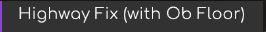

# AvaloniaMod

A collection of Meteor Client modules for Minecraft 1.21.4, built primarily for Constantiam.

AvaloniaMod currently focuses on highway utility modules, with more planned for future releases.

## Modules
### Highway Fix — Without Obsidian Floor

Description: Automatically recasts your Elytra when you reach the highway floor.

Trigger: Y ≤ 119.50
For: Highways without an obsidian floor
Typical range: Below ~1,875,000 blocks in the Nether or ~15,000,000 blocks in the Overworld
Highway Fix — With Obsidian Floor

### Highway Fix - With Obsidian Floor

Automatically recasts your Elytra slightly higher to account for highways with an obsidian floor.

Trigger: Y ≤ 120.50
For: Highways with an obsidian floor
Typical range: Beyond ~1,875,000 blocks in the Nether or ~15,000,000 blocks in the Overworld

AvaloniaMod is currently at v1.0.0, with more modules planned.

Have an idea for something that would be useful on Constantiam? Suggestions, improvements, and module ideas can be submitted through Constantiam chat whispers. (Username Avalon1an)

Built by Avalon1an
